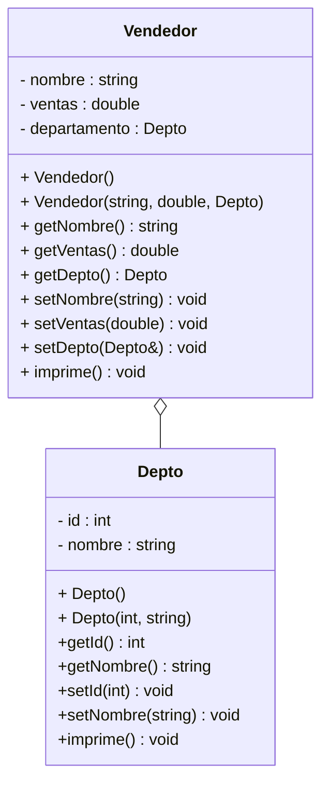

# Ejercicio - Arreglo de objetos y repaso de Composición

Este proyecto tiene la estructura básica para cualquier proyecto C++. 

La carpeta contiene el código fuente y el archivo de construcción ```make```.

La carpeta `build` contiene el codigo binario generado por el archivo de construcción ```make```.

Consulta el archivo assignments/README.md para instrucciones sobre la compilación y ejecución del proyecto.

## Descripción de las clases involucradas

En este ejercicio utilizaremos dos clases, Vendedor y Depto, los cuales ya están codificados, pon atención a la explicación en clase de la profesora para que estés al tanto de qué hace cada clase, sin embargo, aquí te dejo el UML de las clases involucradas:



## Siguiente paso - Completar el exercise.cpp

En el archivo exercise.cpp deberás completar las funciones que se te presentan. En plenaria la maestra hará dos funciones contigo y luego en parejas de soporte deberán realizar las que faltan.

Para cada función sigue las instrucciones que vienen como comentario en cada una de ellas.

Recuerda compilar y correr con make. Prueba que todo funcione adecuadamente.
